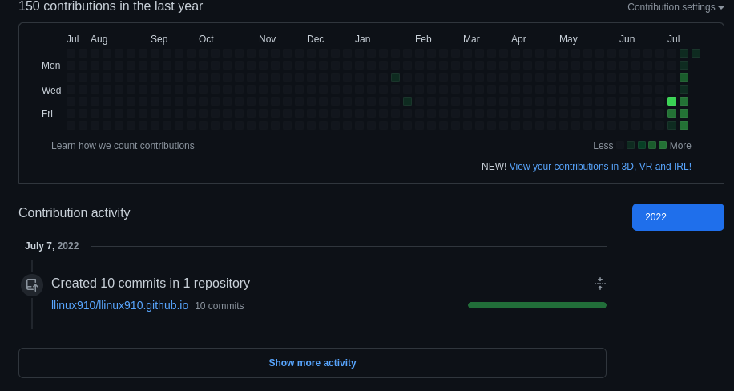
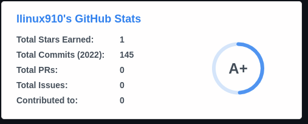

# 개발 일지

## 하려고하는것

앱을 만들려고한다. 기능은

1. 조깅,런닝 정보를 데이터화하고 인터넷이 연결된 환경 어디에서나 접속할 수 있게 한다.(API 서버필요)

2. 위의 데이터를 웹에서 github contributions 정보와 비슷하게 표현

3. 최종적으로 아래와같은 정보취후 이미지로 변환  github페이지 표시할수있게 만든다.

4. 
